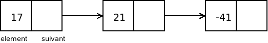

Récursivité : principes et exemples.
===
## Paul Clavier
<today>

---
# Récursivité
* Propriété qu'a un objet a se contenir lui même
* Dans le cadre d'un algorithme récursif, il peut s'appeler lui même

---
# Structures de données récursives
* Liste chainée: chaque cellule contient un lien vers le reste de la liste

* Arbre: chaque noeud contient n liens vers d'autres arbres


---
# Algorithmes récursifs
```python
def add(l):
  if len(l) > 0:
    return l[0] + add(l[1:])
  else:
    return 0
```
* Quand il n'y a pas besoin de se remémorer de l'étape d'avant, on parle de récursivité terminale

```python
def chercher(l, e):
  if l.element = e:
    return True
  if l.suivant != None:
    return chercher(l.suivant, e)
  return False  
 ```
 
 
 ---
 # Crédits Photographiques
 * https://commons.wikimedia.org/wiki/File:Binary_tree.svg?uselang=fr


